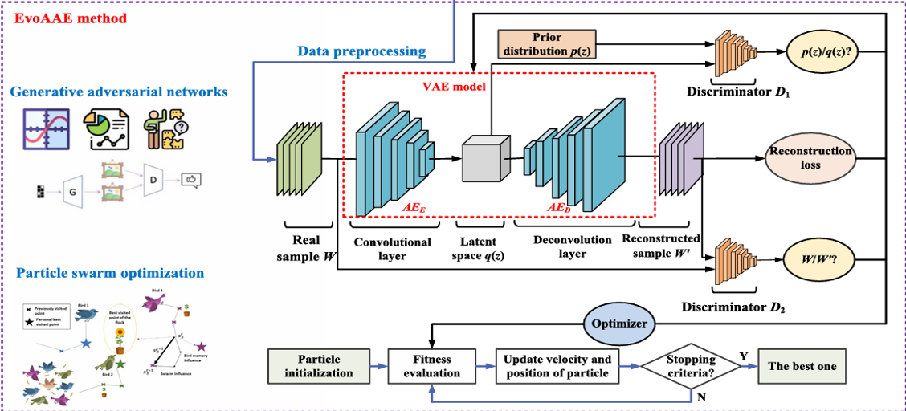

# EvoAAE
Evolutionary Adversarial Autoencoder for Unsupervised Anomaly Detection: Prototype Implementation. 

A cutting-edge unsupervised anomaly detection system combining **Variational Autoencoders (VAE)**, **Generative Adversarial Networks (GAN)**, and **Particle Swarm Optimization (PSO)** for industrial control systems.

EVOAAE article : https://ieeexplore.ieee.org/document/10854883 

  

## Overview

- **Hybrid Architecture**: VAE + GAN + PSO for robust anomaly detection
- **Automated Optimization**: PSO tunes hyperparameters without manual intervention
- **Real-Time Processing**: Handles streaming IIoT data (SWaT, WADI, MSL, PSA)
- **Explainable AI**: Visualizes latent space and reconstruction errors
- **Web Dashboard**: Flask-based interface for model monitoring

## Performance Highlights

| Dataset | Precision | Recall | F₁-score |
|---------|-----------|--------|----------|
| SWaT    | 0.949     | 0.971  | 0.960    |
| WADI    | 0.836     | 0.921  | 0.876    |
| MSL     | 0.972     | 0.964  | 0.968    |
| PSA     | 0.981     | 0.979  | 0.980    |

**Outperforms 9 baseline methods across industrial datasets**

## Architecture Components
#### 1. **Adversarial Autoencoder with Dual Discriminators**
The model implements a sophisticated architecture with:

- **Encoder Network**: Maps input data to latent space with reparameterization trick
- **Decoder Network**: Reconstructs data from latent representations  
- **Latent Discriminator**: Ensures latent space follows prior distribution (N(0,1))
- **Data Discriminator**: Distinguishes between real and reconstructed data
### 2. Multi-Objective Loss Function
The training objective combines multiple loss components:

Total Loss = Reconstruction Loss + β×KL Loss + λ₁×Adversarial Loss(latent) + λ₂×Adversarial Loss(data)

- **Reconstruction Loss**: MSE between input and reconstructed data
- **KL Divergence**: Regularizes latent space to follow standard normal distribution
- **Adversarial Losses**: Dual discriminator losses for enhanced representation learning

### 3. PSO Optimization
Automatically optimizes critical hyperparameters:

  -latent_dim: Dimensionality of latent space (8-64)
  
  -ae_hidden_dim: Hidden layer size for autoencoder (32-256)
  
  -d_hidden_dim: Hidden layer size for discriminators (32-256)
  
  -kl_beta: Weight for KL divergence term (0.1-5.0)

## Key Features
-  **Real-time Anomaly Detection**: Processes streaming industrial data with low latency
- **Interactive Web Interface**: User-friendly Flask-based dashboard for monitoring
- **Advanced Analytics**: 
  - Comprehensive anomaly scoring
  - Interactive visualization tools
- **Flexible Configuration**:
  - Adaptable to different industrial domains (SWaT, WADI, etc.)
  - Customizable detection thresholds
- **Multiple Data Formats Support**:
  - CSV files
  - Excel (.xlsx, .xls)
- **Automated Scaling**:
  - Built-in data preprocessing
  - Automatic normalization
## Installation

### Prerequisites
- **Python 3.11.4** (Recommended)
- pip package manager

## Quick Setup

# Clone the repository
git clone https://github.com/MalharUofA/EvoAAE.git
cd evoaae

# Create and activate virtual environment (Recommended)
python -m venv venv
source venv/bin/activate  # Linux/MacOS
venv\Scripts\activate     # Windows

# Install all dependencies from requirements.txt
pip install -r requirements.txt

# Run the Flask App:
python app.py

# Navigate to http://127.0.0.1:5000

Upload your training dataset (CSV with sensor data)

Train using EvoAAE (with PSO)

Upload the test dataset and detect anomalies. 
